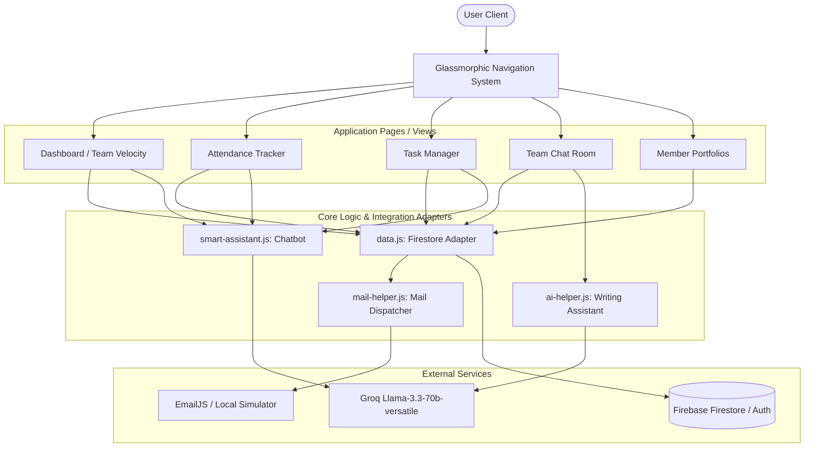

# TEAMLINK - Collaborative Team Management

**TEAMLINK** is a modern, high-performance team management and collaboration platform built with a focus on **Visual Excellence**, **AI-Powered Productivity**, and **Role-Based Security**. It features a trendy glassmorphism navigation system, custom emerald-green styling, and fully responsive layouts for a seamless experience on any device.

---

## 🏗️ Architecture Diagram

Below is the conceptual architecture of the TEAMLINK platform, showing user interactions, internal JavaScript logical modules, and external integrations:



---

## 🛠️ Technical Stack

TEAMLINK utilizes a modern, zero-dependency client-side architecture optimized for visual aesthetics and real-time processing:

- **Core Structure**: HTML5 Semantic markup ensuring search engine visibility and accessibility.
- **Styling System (CSS3)**: A bespoke design system built on custom HSL variables, glassmorphic card layouts, backdrop filters, custom animations, and a polished emerald-green color palette. Fully responsive for Mobile, Tablet, and Desktop viewports.
- **Client Logic**: Modular ES6 JavaScript structure managing dynamic DOM rendering, real-time sync, and UI states.
- **Backend/Platform**:
  - **Firebase Firestore**: A real-time, document-oriented database for synchronizing users, tasks, chat logs, streaks, and attendance records.
  - **Firebase Authentication**: Securing user accounts, roles, and profiles.
- **AI Core (Groq API)**:
  - Powered by the ultra-fast **Llama-3.3-70b-versatile** model.
  - Handles conversational chat queries and contextual message generation using system instructions.
- **Mail Engine (EmailJS)**:
  - Integrated with **EmailJS** REST endpoints for automated SMTP delivery.
  - Features an elegant local **Simulation Mode** (emerald green slide-up toast notifications) for sandbox testing.

---

## ✨ Feature Details

### 1. Role-Based Workspace Security
- **Administrator**: Access to global analytics, task provisioning, member management (creating, editing, deleting users), and verification of submitted task artifacts.
- **Team Member**: Access to personal dashboards, daily attendance markings, current task lists, and personal portfolios.
- **Workspace Guard**: An overlay system that locks core productivity features until a user creates or joins a verified team workspace.

### 2. Task Lifecycle Management
- **Creation & Assignment**: Admins create tasks with specified priorities, descriptions, and deadlines, assigning them directly to team members.
- **Proof-of-Work Submission**: Members submit links and verification notes for completed tasks.
- **Verification Loop**: Admins inspect submissions to **Approve** (marks task complete and increments user streak) or **Request Revisions** (marks task action required with written feedback).

### 3. Productivity & Attendance Tracker
- **Daily Check-in**: A responsive check-in system where members mark themselves present.
- **Streak Multipliers**: Automatically tracks and increments consecutive active days (from daily check-ins and task completions).
- **Engagement Statistics**: Real-time velocity charts showing team completion rates, streak metrics, and task progress.

### 4. AI Writing Helper & Tone Cleanup
- **Inline Assistant**: Nested directly in the Team Chat input field.
- **Tone Presets**: Instantly rewrites messages into **Professional**, **Friendly**, **Concise**, **Assertive**, **Elaborate**, or **Fix Grammar** styles.
- **Custom Instruction Adapter**: Allows users to type custom instructions (e.g. *"Make this sound urgent but polite"*).

### 5. Floating Smart AI Chatbot Companion
- **Real-Time Data Integration**: Directly fetches and stringifies current user data, active tasks, team lists, and today's attendance records.
- **Contextual Understanding**: Fully understands the current workspace context. Answers questions like *"What is overdue?"*, *"What should I do today?"*, or *"Summarize team progress"* with high accuracy.
- **No-Prompt Key Injection**: Configured globally by the developer; end-users never have to input or configure their own API keys.

### 6. Mail Notification System
- **Real-Time Dispatch**: Automatically sends emails when high-importance events occur.
- **Account Provisioning**: Emails newly created users with their usernames and temporary passwords.
- **Workflow Alerts**: Sends emails for new task assignments, task approvals, and change requests (rejections).
- **Fallback Simulation**: If EmailJS is not configured, it generates a premium, animated mock email toast on-screen displaying the exact mail payload.

---

## 🚀 Getting Started

### Installation & Setup
1. Clone the project repository.
2. Navigate to the project root directory: `cd teammanagement`.
3. Configure your API keys in [firebase-config.js](file:///c:/Users/karthick/Desktop/team%20management/teammanagement/js/firebase-config.js):
   ```javascript
   export const GROQ_API_KEY = "gsk_..."; // Your Groq API Key
   export const EMAILJS_SERVICE_ID = "YOUR_SERVICE_ID"; // Optional EmailJS ID
   ```
4. Start your local HTTP server:
   ```bash
   npx http-server .
   ```
5. Access the application at `http://localhost:8080`.
